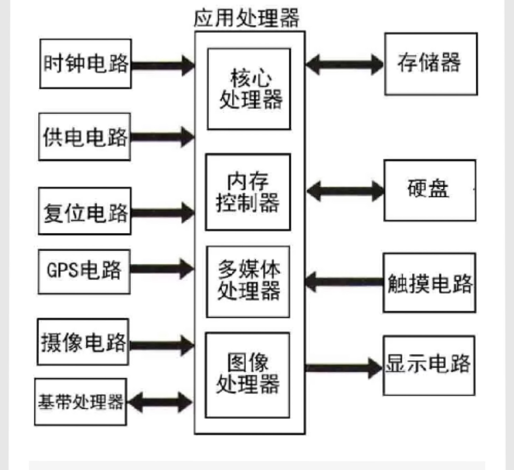
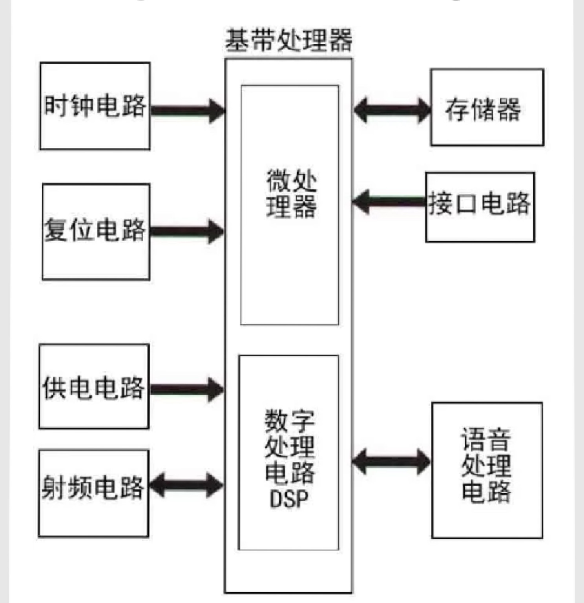

# mobile phone

## 手机结构

主板

显示屏

电池

外壳

！[手机](./手机.jpg)

### 1.显示屏

屏幕材质

### 2.主板

1. 按照电路划分

   1. 接口电路

      * 存储卡接口、SIM卡接口、USB接口、HDMI接口

   2. 处理器电路

      * 应用处理器AP
      * 基带处理器BP

   3. 电源管理及充电电路

      * 电源键
      * 电源管理芯片

      * 充电控制芯片
      * 充电接口
      * 电池接口

   4. 射频电路

      * 射频天线
        * 接收和发射信号的共用部件
      * 射频收发电路
      * 射频功率放大器
        * 放大待接收或发射的信号
      * 射频电源管理芯片
      * 射频信号处理芯片
      * 滤波器
      * 晶体...

   5. 音频处理电路

      * 话筒
      * 听筒
      * 耳机接口
      * 扬声器
      * 耳机信号放大器
      * 音频功率放大器
      * 语音信号处理芯片

   6. 触摸屏显电路

      * 拍摄按键
      * 音量调整按键
      * 其他功能按键
      * 显示屏接口
      * 触摸屏接口

   7. 其他功能电路

      * 照相/摄像电路、振动电路、GPS、红外/蓝牙、NFC、FM收音电路、闪光灯
      * 传感器：霍尔传感器、磁阻传感器、加速度传感器、磁力传感器、接近传感器、环境光传感器、陀螺仪、气压传感器、指纹传感器、重力传感器

### 3.电池

### 4.外壳

---

---

## 处理器

### 应用处理器AP(SOC)

负责手机多媒体功能，包括图像、声音、视频、3D图形、照相等

***图片仅供参考***

#### 中央处理器CPU

#### 图形处理器GPU

#### DDR（双倍速率SDRAM）

### 基带处理器BP

负责数据处理和存储

***图片仅供参考***

#### 数字信号处理器DSP

#### 微控制器MCU

#### 内存（SRAM、Flash）

## 信号

1. 天线接收附近基站发射的电磁波（来电）
2. 电磁波经过射频电路、语音电路、微处理器处理后向听筒输送语音信号
3. 讲话的声音经过话筒转化为电信号、经过语音电路、微处理器、射频电路
4. 经过天线将电信号转换成电磁波发射出去

发射时：调制、滤波、射频放大、功率放大，通过射频收发电路从天线发送出去

接收时：

接收电磁波信号-射频芯片-基带信号-基带芯片-声音

* wifi和蓝牙工作频率都在2.4G，部分电路共用，因此经常集成在一个芯片上
* GPS、wifi、蓝牙、NFC、通话一般都要通过基带处理器。一般工作频率不同会使用不同的天线，因此手机里有多根天线，现在也有可以工作在不同频率的天线，但是由于不同部件工作的独立性，一般会有多个天线。
* 主天线（GSM、WCDMA、LTE共用）、WIFI、BT、GPS、NFC、FM、分集天线（增强信号接收）。常见的有蓝牙、WIFI共用天线；也有蓝牙、WIFI、GPS共用天线；有的GPS和通讯的天线共用。

